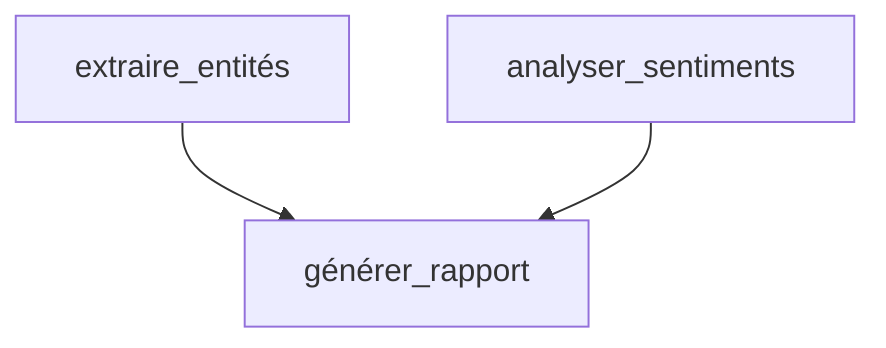

# Agent Task Decomposer

## Quand l'utiliser

Utiliser ce skill quand une tâche est trop vaste ou hétérogène pour un seul agent : longue durée estimée, compétences multiples requises, ou parties indépendantes parallélisables. Indispensable avant tout dispatch vers des sous-agents.

**Seuil pratique** : si la tâche dépasse ~3 min d'exécution ou implique >2 domaines distincts (recherche + code + validation), décomposer.

## Choisir la bonne stratégie

| Stratégie | Quand l'utiliser | Exemple |
|---|---|---|
| `sequential` | Chaque étape dépend de la précédente | Pipeline ETL : extract → transform → load |
| `parallel` | Toutes les parties sont indépendantes | Analyser 10 fichiers log simultanément |
| `tree` | Décomposition récursive avec agrégation finale | Rapport multi-sections avec résumé global |
| `dag` | Mix de parallèle et séquentiel, dépendances complexes | Build CI : tests parallèles → package → deploy |

Critère de décision rapide :
```
toutes indépendantes → parallel
chaîne stricte → sequential
branches qui se rejoignent → tree ou dag
```

## Workflow

### 1. Analyser la tâche principale

Avant de couper quoi que ce soit, répondre à ces questions :
- **Livrable attendu** : format exact, critères de qualité, destinataire
- **Contraintes** : budget tokens, deadline, outils disponibles
- **Données d'entrée** : quelles informations sont disponibles dès le départ, lesquelles viennent d'autres sous-tâches
- **Risques** : quelle sous-tâche peut bloquer l'ensemble si elle échoue

Si l'objectif est ambigu, clarifier d'abord. Une mauvaise décomposition coûte plus cher qu'une question posée.

### 2. Identifier et nommer les sous-tâches

Règles d'atomicité :
- Une sous-tâche = un seul agent, pas de sous-décomposition interne
- Elle produit un livrable intermédiaire **vérifiable** (fichier, JSON, résultat booléen)
- Elle est nommée avec un verbe d'action : `extraire_entités`, `générer_rapport`, `valider_schema`

Modèle de données minimal :
```python
class SubTask(BaseModel):
    id: str                        # ex: "T1", "T2"
    name: str                      # verbe + complément
    description: str
    depends_on: list[str]          # IDs des sous-tâches dont le résultat est requis
    expected_output: str           # format précis du livrable
    capability: str                # "search" | "code" | "write" | "validate" | "transform"
    complexity: Literal["low", "medium", "high"]
```

### 3. Modéliser les dépendances (DAG)

Construire le graphe et vérifier l'absence de cycles avant toute exécution :
```python
import networkx as nx

def build_and_validate_dag(subtasks: list[SubTask]) -> nx.DiGraph:
    G = nx.DiGraph()
    for t in subtasks:
        G.add_node(t.id, label=t.name)
        for dep in t.depends_on:
            G.add_edge(dep, t.id)
    if not nx.is_directed_acyclic_graph(G):
        cycles = list(nx.simple_cycles(G))
        raise ValueError(f"Cycles détectés : {cycles}")
    return G

def execution_batches(G: nx.DiGraph) -> list[list[str]]:
    """Retourne des groupes de tâches exécutables en parallèle."""
    return [list(gen) for gen in nx.topological_generations(G)]

def critical_path(G: nx.DiGraph) -> list[str]:
    return nx.dag_longest_path(G)
```

Exemple de plan Mermaid généré automatiquement :
```python
def to_mermaid(subtasks: list[SubTask]) -> str:
    lines = ["graph TD"]
    for t in subtasks:
        lines.append(f'  {t.id}["{t.name}"]')
        for dep in t.depends_on:
            lines.append(f"  {dep} --> {t.id}")
    return "\n".join(lines)
```

Résultat :


### 4. Estimer complexité et allouer les ressources

| Complexité | Modèle recommandé | Tokens estimés | Timeout |
|---|---|---|---|
| `low` | claude-haiku / gpt-4o-mini | ~500 | 15 s |
| `medium` | claude-sonnet / gpt-4o | ~2 000 | 60 s |
| `high` | claude-opus / o3 | ~8 000 | 180 s |

Calculer le coût total estimé sur le chemin critique uniquement — les branches parallèles ne s'additionnent pas.

### 5. Assigner aux sous-agents

Mapper `capability` → agent spécialisé. Load-balancing si plusieurs agents ont la même capacité :
```python
def assign_tasks(subtasks: list[SubTask], agents: dict[str, list]) -> dict[str, str]:
    """agents = {"search": [AgentA, AgentB], "code": [AgentC]}"""
    workload: dict = {}
    assignments: dict = {}
    for t in subtasks:
        candidates = agents.get(t.capability, [])
        if not candidates:
            raise ValueError(f"Aucun agent disponible pour '{t.capability}'")
        agent = min(candidates, key=lambda a: workload.get(a.id, 0))
        assignments[t.id] = agent.id
        workload[agent.id] = workload.get(agent.id, 0) + 1
    return assignments
```

### 6. Exécuter avec checkpoints inter-batches

Ne jamais lancer le batch N+1 sans valider le batch N :
```python
async def execute_plan(batches: list[list[str]], run_task, validate):
    results = {}
    for batch in batches:
        batch_results = await asyncio.gather(
            *[run_task(task_id, results) for task_id in batch],
            return_exceptions=True
        )
        for task_id, result in zip(batch, batch_results):
            if isinstance(result, Exception) or not validate(task_id, result):
                raise RuntimeError(f"Échec sur {task_id} : {result}")
            results[task_id] = result
    return results
```

### 7. Re-planning dynamique en cas d'échec

Si une sous-tâche échoue sur le chemin critique :
1. **Retry** avec paramètres différents (modèle plus puissant, prompt reformulé)
2. **Sous-décomposition** : découper cette sous-tâche en parties plus petites
3. **Fallback** : résultat dégradé acceptable pour continuer
4. **Arrêt contrôlé** : remonter l'erreur avec contexte complet (ne pas échouer silencieusement)

```python
async def handle_task_failure(task: SubTask, plan, results):
    # Tentative 1 : retry avec modèle supérieur
    if task.complexity != "high":
        return await retry_with_upgrade(task, results)
    # Tentative 2 : sous-décomposition
    finer = decompose_further(task)
    return await execute_plan(build_and_validate_dag(finer), ...)
```

## Anti-patterns et garde-fous

| Anti-pattern | Symptôme | Correction |
|---|---|---|
| **Sous-tâches trop couplées** | État partagé mutable entre tâches | Chaque sous-tâche reçoit ses inputs en paramètre, retourne ses outputs sans side-effect |
| **Décomposition trop fine** | Dizaines de micro-tâches de <2 s | Fusionner : granularité cible ≥ 10 s d'exécution par sous-tâche |
| **Dépendances ignorées** | Exécution "tout parallèle" qui produit des résultats incohérents | Toujours modéliser le DAG, même pour 3 tâches |
| **Plan rigide** | Échec total au premier imprévu | Prévoir retry + fallback sur chaque nœud du chemin critique |
| **Livrable non vérifiable** | Échec silencieux non détecté | `expected_output` doit être testable (schéma JSON, assertion, checksum) |
| **Re-planning infini** | Boucle de sous-décompositions récursives | Limiter à 2 niveaux de re-planning ; au-delà, escalader à l'humain |

## Bonnes pratiques 2026

- **Nommer les sous-tâches avec un verbe** — facilite la traçabilité dans les logs et les audits d'agents.
- **Chemin critique en priorité** — lancer les tâches du chemin critique en premier, même si d'autres sont prêtes.
- **Contexte minimal par sous-tâche** — ne passer que les données strictement nécessaires ; pas de dump complet du contexte parent (coût tokens, risque de confusion).
- **Idempotence** — chaque sous-tâche doit pouvoir être relancée sans effet de bord : écriture dans un fichier nommé par son `id`, pas append dans un fichier partagé.
- **Traces structurées** — logger `task_id`, `batch`, `duration_ms`, `tokens_used`, `status` pour chaque sous-tâche : indispensable pour diagnostiquer les lenteurs et optimiser les plans futurs.
