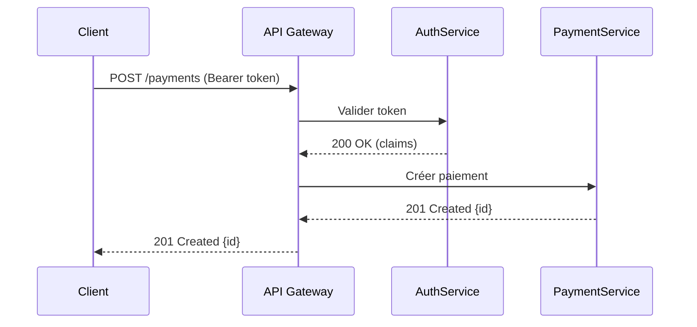

# Technical Writing Guide

## Critères de choix du format

| Besoin | Format recommandé |
|---|---|
| Décision d'architecture irréversible | ADR |
| Proposition de changement à débattre | RFC |
| Point d'entrée d'un projet | README |
| Procédure d'exploitation | Runbook |
| Endpoint HTTP/REST | OpenAPI YAML |
| Flux complexe multi-acteurs | Sequence diagram Mermaid |
| Post-incident | Post-mortem |

---

## Workflow en étapes

### 1. Identifier l'audience avant d'écrire

Poser trois questions avant la première ligne :
- Qui lit ? (dev junior, ops, management, utilisateur final)
- Quel niveau technique ?
- Quel objectif du lecteur ? (installer, comprendre, décider, opérer)

**Règle de test** : si tu ne peux pas répondre à ces trois questions, n'écris pas encore.

---

### 2. README — structure minimale copiable

```markdown
# Nom du projet

Badge CI · Badge coverage · Badge version

> Une ligne : ce que fait le projet et pourquoi.

## Prérequis
- Node 20+ / Java 21+ / Python 3.12+
- Variables d'env : `cp .env.example .env`

## Installation
```bash
git clone https://github.com/org/repo
cd repo
make install   # ou npm ci / mvn install
```

## Usage rapide
```bash
# Lancer en local
make dev

# Appel API minimal
curl -X POST http://localhost:8080/api/v1/resource \
  -H "Authorization: Bearer $TOKEN" \
  -H "Content-Type: application/json" \
  -d '{"key": "value"}'
```

## Structure du projet
src/
├── api/        # controllers REST
├── domain/     # logique métier pure
└── infra/      # adapters DB, messaging

## Contribuer
Voir [CONTRIBUTING.md](./CONTRIBUTING.md)

## Licence
MIT
```

**Anti-patterns README** :
- Pas de section "About" vide ou copiée-collée du nom du repo.
- Pas d'instructions d'installation sans exemple de commande testable.
- Pas de README sans section "Usage" avec une commande concrète.

---

### 3. ADR — Architecture Decision Record

Stocker dans `/docs/adr/ADR-NNN-titre-court.md`. Numérotation séquentielle, jamais réutilisée.

**Template ADR** :

```markdown
# ADR-001 : Utiliser PostgreSQL comme base de données principale

**Statut** : Accepted  
**Date** : 2026-03-15  
**Auteur** : @khalil  
**Remplacé par** : —

## Contexte
Le service Payment nécessite des transactions ACID, des requêtes complexes avec
jointures et un volume prévu de 10 M lignes/mois.

## Décision
Adopter PostgreSQL 16 (géré via RDS), avec schéma versionné par Flyway.

## Alternatives écartées
| Option | Raison d'exclusion |
|---|---|
| MySQL 8 | JSON support moins mature, window functions limitées |
| MongoDB | Pas d'ACID multi-document natif (pré-4.0) |
| DynamoDB | Modèle de coût imprévisible, jointures impossibles |

## Conséquences
**Positif** : transactions ACID garanties, écosystème outillage riche.  
**Négatif** : coût opérationnel RDS, compétence DBA requise.  
**Neutre** : migrations Flyway obligatoires dès le sprint 1.
```

**Statuts valides** : `Proposed` → `Accepted` → `Deprecated` / `Superseded by ADR-NNN`.

---

### 4. RFC — Request for Comments

Utiliser quand la décision est ouverte au débat (> 2 équipes concernées, impact cross-service, durée de vie > 6 mois).

**Structure RFC** :

```markdown
# RFC-012 : Stratégie d'authentification inter-services

**Statut** : Draft | In Review | Accepted | Rejected  
**Deadline feedback** : 2026-07-01  
**Auteur** : @khalil  
**Reviewers** : @ops-lead, @security-team

## Résumé (TL;DR)
Remplacer les API keys partagées par des JWT signés (RS256) avec rotation automatique.

## Problème
[Décrire le pain point actuel avec métriques si possible]

## Proposition
[Solution détaillée, schéma si utile]

## Alternatives
[Tableau comparatif]

## Questions ouvertes
- [ ] Durée de vie des tokens (15 min vs 1h) ?
- [ ] Révocation : blocklist Redis ou rotation ?

## Plan de migration
Phase 1 : dual-mode (clé + JWT). Phase 2 : JWT seul (M+3).
```

---

### 5. Documentation API — OpenAPI first

Générer la spec OpenAPI en amont (contract-first), pas après coup.

```yaml
# openapi.yaml — extrait
paths:
  /v1/payments:
    post:
      summary: Initier un paiement
      tags: [Payments]
      security:
        - BearerAuth: []
      requestBody:
        required: true
        content:
          application/json:
            schema:
              $ref: '#/components/schemas/PaymentRequest'
            example:
              amount: 1500
              currency: TND
              reference: "PAY-2026-001"
      responses:
        '201':
          description: Paiement créé
          content:
            application/json:
              example:
                id: "pay_xyz"
                status: pending
        '400':
          $ref: '#/components/responses/BadRequest'
        '401':
          $ref: '#/components/responses/Unauthorized'
```

**À couvrir obligatoirement** : auth (Bearer/API key), codes d'erreur métier (pas seulement HTTP), rate limits, exemples requête + réponse, pagination.

---

### 6. Diagrammes — Mermaid en priorité

Mermaid est rendu nativement dans GitHub, GitLab, Notion, Obsidian. Versionner la source dans le repo.

**Sequence diagram** :



**Quand utiliser quoi** :
- `sequenceDiagram` → flux HTTP/event entre services
- `flowchart TD` → algorithme, arbre de décision
- `erDiagram` → schéma de base de données
- C4 PlantUML → vues d'architecture (Context/Container)

---

### 7. Style et clarté — règles concrètes

| Règle | Mauvais | Bon |
|---|---|---|
| Voix active | "Une requête est envoyée par le service" | "Le service envoie une requête" |
| Phrases courtes | Bloc de 50 mots sans ponctuation | Max 20 mots par phrase |
| Définir l'acronyme | "Le JWT est validé" | "Le JWT (JSON Web Token) est validé" |
| Exemple avant abstrait | "La méthode retry gère les erreurs" | `retry(fn, {attempts: 3, delay: 500})` |
| Titres actionnables | "Informations" | "Comment configurer l'authentification" |

---

### 8. Maintenance et docs-as-code

```
repo/
├── docs/
│   ├── adr/          # ADR-NNN-titre.md
│   ├── runbooks/     # procédures ops
│   └── api/          # openapi.yaml
├── README.md
└── CONTRIBUTING.md
```

**CI checks à ajouter** :

```yaml
# .github/workflows/docs.yml
- name: Vérifier liens cassés
  uses: lycheeverse/lychee-action@v1
  with:
    args: --verbose --no-progress './**/*.md'

- name: Spell check
  uses: streetsidesoftware/cspell-action@v6
  with:
    files: "**/*.md"
```

**Règles de maintenance** :
- Chaque doc a un `owner` dans le frontmatter ou en en-tête.
- Revue obligatoire si la feature associée change (PR checklist).
- Doc obsolète → bannière `> ⚠️ Cette page est obsolète. Voir [lien].` + archivage dans `/docs/archive/`.
- Jamais de wiki isolé sans lien depuis le repo.

---

## Anti-patterns à éviter

- **Doc écrite après coup** : la doc rédigée 3 sprints après le code ne reflète plus la réalité — écrire en même temps que le code.
- **Screenshots d'interface** : vieillissent vite ; préférer des commandes textuelles ou des exemples JSON.
- **"TODO: documenter"** : bloquer le merge PR si la section doc est vide.
- **Un seul long document** : diviser par audience et par cas d'usage, pas par chronologie.
- **Jargon interne non défini** : "ledger", "extourne", "régularisation" doivent être définis à la première occurrence dans tout document partagé hors équipe.
- **Diagrammes en image PNG sans source** : impossible à versionner et à faire évoluer ; toujours committer la source Mermaid/PlantUML.
