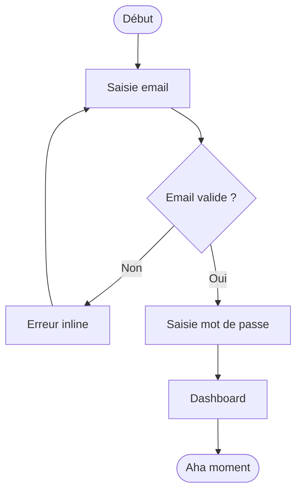

# User Flow Designer

## Workflow en 8 étapes

### 1. Cadrer objectifs et périmètre

- **Jobs-to-be-done** : énoncez le job en format `Quand [situation], je veux [motivation] pour [outcome attendu]`.
- **Métriques de succès** : taux d'activation, time-to-value, drop rate par étape, taux de complétion.
- **Tensions business/UX** : identifiez explicitement les conflits (ex. : collecte de données vs. friction à l'inscription) et choisissez un compromis documenté.
- **Persona et contexte** : device dominant (mobile first ?), niveau technique, langue, connectivité (3G toléré ?).

### 2. Auditer le flow existant

Si un flow existe déjà :

```
[Page/Écran A] → [Action] → [Page/Écran B] → [Action] → ...
                                 ↓ 30% drop
                           [Erreur / Hésitation]
```

- Listez chaque étape avec le drop rate mesurable (Mixpanel, GA4, Amplitude).
- Catégorisez chaque friction : **confusion** (UX), **technique** (bug), **motivationnelle** (valeur pas claire), **sécurité** (méfiance).
- Priorisez les frictions par impact = `volume × taux de drop × valeur unitaire`.

### 3. Designer le happy path

Règles strictes :

- **Minimum viable steps** : supprimez toute étape qui ne génère pas de valeur perceptible ou de donnée critique.
- **Progressive disclosure** : montrez uniquement ce dont l'utilisateur a besoin à cette étape. Exemple : ne demandez pas la date de naissance avant que l'utilisateur soit prêt à finaliser le profil.
- **One primary action per screen** : un seul CTA visible par vue ; les actions secondaires en link discret.
- **Décision à 7 options max** (loi de Miller) : si un choix dépasse 7 items, ajoutez un filtre ou segmentez.

Exemple de notation concise d'un happy path :

```
START
 └─ [Écran 1 : Email + MDP]  →  [Vérification email]
     └─ [Écran 2 : Profil minimal (prénom, photo optionnelle)]
         └─ [Aha moment : dashboard peuplé avec données exemple]
             └─ END / activation
```

### 4. Cartographier les edge cases

Matrice à remplir pour chaque étape critique :

| Edge case | Probabilité | Impact | Traitement |
|---|---|---|---|
| Validation email échouée | Élevée | Bloquant | Inline error + suggestion typo (Mailcheck.js) |
| Timeout réseau | Moyenne | Bloquant | Retry auto + toast "Nouvelle tentative…" |
| Permissions refusées (caméra) | Moyenne | Partiel | Flow alternatif sans photo, prompt educatif |
| État vide (0 donnée) | Élevée | Motivationnel | Empty state illustré + action suggérée |
| Retour arrière mid-flow | Haute | Perte données | Persistance locale (localStorage / sessionStorage) |

### 5. Optimiser la conversion

Techniques actionnables :

- **Chunking** : découpez les formulaires longs en 3-5 étapes avec progress bar (`Étape 2 sur 4`).
- **Autofill & pré-remplissage** : utilisez les hints HTML5 (`autocomplete="email"`) et les données disponibles (OAuth → prénom pré-rempli).
- **Social proof contextuel** : placez les éléments de réassurance juste avant la décision critique (ex. : `"⭐ 4.8 — 12 000 avis"` avant le bouton de paiement).
- **Momentum** : commencez par des étapes simples (email) avant les étapes sensibles (CB). L'utilisateur investit progressivement.
- **Sauvegarder la progression** : si le flow dure > 2 min, proposez "Continuer plus tard" avec lien email.

### 6. Concevoir l'onboarding

```
Inscription → [Aha moment le plus court possible] → Valeur prouvée → Demande d'effort
```

Critères de placement de l'aha moment :
- Duolingo : première leçon complétée avant création de compte.
- Figma : fichier exemple ouvert immédiatement après signup.
- Stripe : première transaction test réussie sans carte réelle.

Règles tooltips / coachmarks :
- Max 3 étapes dans un wizard guidé.
- Toujours offrir "Passer" visible.
- Déclenchez les tooltips sur l'action (hover / focus), jamais au chargement de page.

### 7. Représentation visuelle

Choisissez le bon format selon le besoin :

| Format | Quand l'utiliser | Outil |
|---|---|---|
| **Flowchart** | Flow simple, équipe dev | draw.io, Mermaid |
| **User Story Map** | Planification produit / backlog | Miro, Notion |
| **Service Blueprint** | Flows multi-acteurs (ops, backend) | FigJam, Miro |
| **Storyboard** | Communication design émotionnel | Figma, Balsamiq |

Notation Mermaid copiable :



### 8. Mesure et itération

Définissez les events analytics **avant** le développement :

```js
// Exemple Segment / Amplitude
analytics.track('Flow Step Completed', {
  flow: 'onboarding',
  step: 2,
  step_name: 'profile_setup',
  time_spent_ms: 4200,
  skipped: false,
});
```

KPIs par phase :
- **Acquisition → Activation** : % users atteignant l'aha moment sous 5 min.
- **Activation → Rétention** : retour J+7.
- **Funnel par étape** : drop rate cible < 20 % par étape (sauf étapes intentionnellement filtrantes).

A/B test en priorité sur : CTA label, order des champs, étapes requises vs. optionnelles.

---

## Anti-patterns / Pièges

| Anti-pattern | Symptôme | Correction |
|---|---|---|
| **Registration wall** | Demander compte avant valeur | Montrer la valeur d'abord (guest mode, démo) |
| **Form wall** | > 5 champs page 1 | Progressive disclosure, champs optionnels masqués |
| **Faux progress bar** | Barre qui bloque à 90 % | Progress basé sur étapes réelles |
| **Dark patterns** | Opt-out caché, case pré-cochée | Illégal RGPD + perte de confiance irréversible |
| **Edge case first** | Flow complexifié par cas rares | Happy path d'abord, edge cases en overlay/aside |
| **Pas de fallback offline** | App bloque sans réseau | Cache local, message d'état clair |
| **Notifications prématurées** | Permission push demandée à l'arrivée | Demandez après la première valeur prouvée |

## Bonnes pratiques 2026

- **Passwordless en priorité** : proposez magic link / passkey (WebAuthn) avant MDP classique — réduit le drop d'inscription de 30-40 % en moyenne.
- **Accessibility first** : le flow doit passer WCAG 2.2 AA ; focus order, aria-live pour les erreurs inline, skip links.
- **AI-assisted onboarding** : personnalisez le flow selon le profil détecté (secteur, taille d'équipe) pour afficher uniquement les étapes pertinentes.
- **Consent-first RGPD** : bannière de consentement avant tout tracking analytics, cookies classifiés explicitement.
- **Mobile gestures** : sur mobile, préférez les bottom sheets et les swipe gestures aux modales plein écran.
- **Skeleton screens** : remplacez les spinners par des squelettes de contenu pour réduire l'anxiété de chargement perçu.
